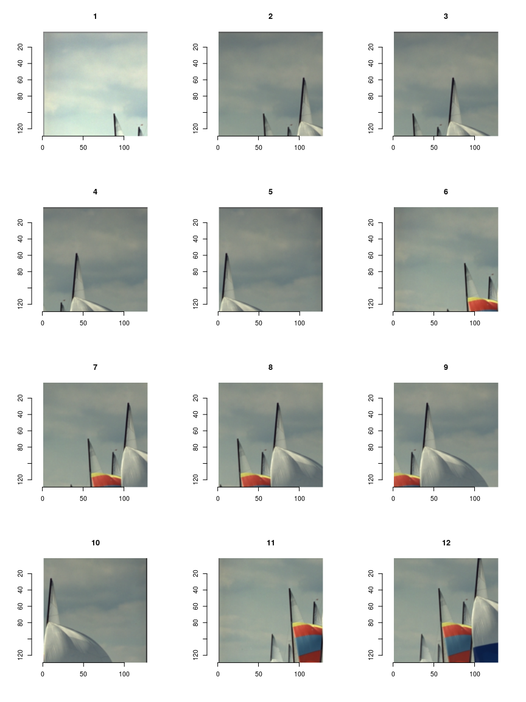

[](https://choosealicense.com/)
[](/commits/master)
[](https://www.tidyverse.org/lifecycle/#experimental)
[](https://travis-ci.org/srvanderplas/ImageTools)
[](https://codecov.io/github/srvanderplas/ImageTools?branch=master)
<!-- README.md is generated from README.Rmd. Please edit that file -->

# ImageTools

ImageTools is intended to be a convenience package of functions for
working with images.

## Installation

You can install the released version of ImageTools from
[CRAN](https://CRAN.R-project.org) with:

``` r
install.packages("ImageTools")
```

## Example

This is a basic example which shows you how to solve a common problem:

``` r
library(imager)
#> Loading required package: magrittr
#> 
#> Attaching package: 'imager'
#> The following object is masked from 'package:magrittr':
#> 
#>     add
#> The following objects are masked from 'package:stats':
#> 
#>     convolve, spectrum
#> The following object is masked from 'package:graphics':
#> 
#>     frame
#> The following object is masked from 'package:base':
#> 
#>     save.image
library(ImageTools)
res <- all_slices(boats, size = c(128, 128), delta = c(32, 32))

par(mfrow = c(3, 4))
plot(as.imlist(res$img)[1:12])
```


